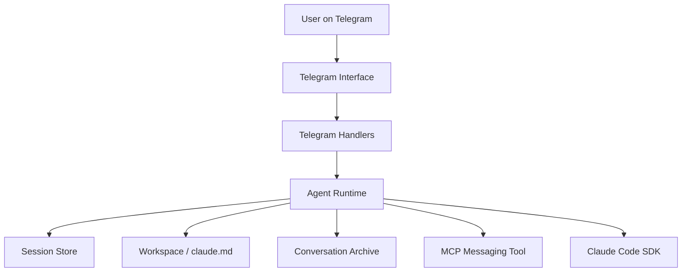

[](README.md)
[](README_CN.md)

# Nano OpenClaw

> A personal automation assistant runtime with memory, workspace awareness, and tool execution, where Telegram is only the front door.

**Nano OpenClaw is built for developers who want more than a chat wrapper.**  
It is designed as a persistent personal agent system that can remember, inspect files, use tools, and operate inside a real working directory.

<p>
  <a href="#core-strengths"><strong>Core Strengths</strong></a> ·
  <a href="#architecture-overview"><strong>Architecture</strong></a> ·
  <a href="#project-structure"><strong>Structure</strong></a> ·
  <a href="#roadmap-direction"><strong>Roadmap</strong></a> ·
  <a href="README_CN.md"><strong>中文版本</strong></a>
</p>

Nano OpenClaw is a personal automation assistant project built around a durable agent runtime, a persistent workspace, and a Telegram interface.

Telegram is only the entry point. The real core of the project is an agent system that can keep memory, operate on files, call tools, maintain a working directory, and evolve into a broader personal automation platform.

## Why This Project Exists

Most Telegram AI bots are just thin chat wrappers around a model API. They can answer questions, but they do not really *work*.

Nano OpenClaw is designed around a different idea:

- The assistant should have a real workspace.
- The assistant should be able to retain useful memory across sessions.
- The assistant should be able to use tools, inspect files, and make changes.
- The messaging layer should be replaceable; Telegram happens to be the current interface.

That makes this repository closer to a personal agent runtime than to a conventional bot demo.

## Core Strengths

### Persistent Memory Beyond a Single Chat Turn

Nano OpenClaw combines two layers of memory:

- Session continuation through persisted `session_id`
- Long-term project memory through `work_space/claude.md`
- Daily conversation archives in `work_space/conversations/`

This gives the assistant both short-horizon continuity and long-horizon recall.

### Workspace-Centered Agent Design

The assistant does not operate as a stateless chat endpoint. It runs against a dedicated workspace and can:

- read and write files
- edit project artifacts
- inspect archived conversations
- maintain assistant memory
- execute shell commands when needed

This makes the assistant useful for real automation flows instead of simple message-response interactions.

### Claude Code SDK Integration

The project uses `claude-agent-sdk` as the agent runtime and augments it with:

- custom system prompt assembly
- session persistence
- Telegram messaging integration
- MCP-based outbound assistant messaging
- structured logging for tool and stream events

### Modular Architecture

The current active implementation is organized under `src/nanoclaw/` rather than being kept in a single script. The runtime is split into focused modules for:

- application bootstrap
- configuration and paths
- workspace preparation
- conversation archiving
- session storage
- MCP tool setup
- agent execution
- Telegram handlers
- logging

This keeps the project maintainable as the assistant grows beyond a single interface or a single model setup.

## Architecture Overview



The interface layer is intentionally thin. Telegram delivers messages, but the durable behavior lives in the runtime, memory, workspace, and tool layers.

## Project Structure

```text
main.py                    # Thin runtime entrypoint
src/nanoclaw/
  app.py                   # Application assembly and boot
  agent.py                 # Claude agent execution and locking
  config.py                # Shared settings, paths, templates
  conversation.py          # Daily conversation archive
  handlers.py              # Telegram command/message handlers
  logging_utils.py         # Logging setup
  mcp.py                   # MCP server tool registration
  session_store.py         # session_id persistence
  workspace.py             # Workspace bootstrap and system prompt build
work_space/
  claude.md                # Long-term assistant memory
  conversations/           # Daily archived conversations
data/
  state.json               # Persisted session state
ep1.py ~ ep6.py            # Historical versions kept for reference
```

## Technology Stack

- Python 3.12+
- `python-telegram-bot`
- `claude-agent-sdk`
- `python-dotenv`
- Hatchling-based packaging with `src/` layout

## Current Capabilities

At the current stage, Nano OpenClaw can:

- receive commands and messages from Telegram
- continue prior Claude sessions
- maintain assistant memory in `claude.md`
- archive conversations by date
- call Claude tools against a real workspace
- send assistant-authored messages back through Telegram
- keep the active runtime modular and extensible

## Current Boundaries

Nano OpenClaw is already useful, but it is intentionally still small in scope. The current version does **not** yet aim to be:

- a multi-user platform
- an interruptible streaming agent runtime
- a production orchestration system
- a generalized scheduling and automation hub

Those are valid future directions, but the repository is currently optimized for a single-owner personal assistant workflow.

## Coming Soon

The current runtime is intentionally compact, but the next stage is already clear. Areas planned for expansion include:

- a richer skill system for reusable agent behaviors
- scheduled jobs and time-based automation
- stronger long-term memory organization and retrieval
- cleaner interruptible execution flow
- more interfaces beyond Telegram

The goal is not to turn Nano OpenClaw into a bloated platform, but to make it a sharper and more capable personal automation runtime.

## Roadmap Direction

The project is evolving toward a more capable personal automation system with directions such as:

- interruptible agent execution
- richer memory retrieval strategies
- more structured task scheduling
- additional interfaces beyond Telegram
- clearer separation between runtime, memory, and interface layers

## Running the Project

This repository is developer-focused. If you want to run it locally, the minimal path is:

1. Create a `.env` file with the required Telegram and model credentials.
2. Install dependencies.
3. Start the runtime with:

```bash
uv run main.py
```

## Project Status

Nano OpenClaw is an actively evolving personal agent project. Historical milestone versions are preserved in `ep1.py` through `ep6.py`, while the modular runtime under `src/nanoclaw/` is the current maintained implementation.

## Chinese Version

For the Chinese README, see [README_CN.md](README_CN.md).
