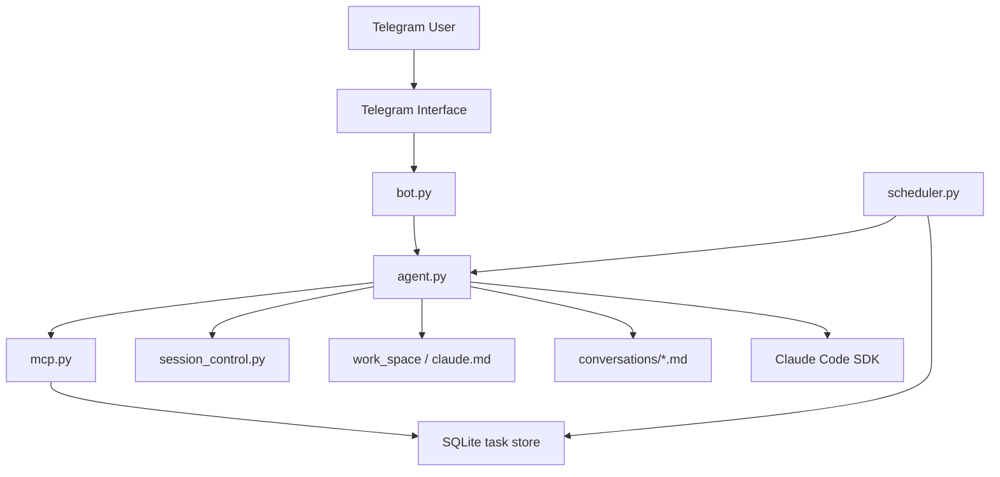

[](README.md)
[](README_CN.md)

# Nano OpenClaw

> A personal automation assistant runtime with memory, workspace awareness, scheduled execution, and tool calling, where Telegram is only the entry point.

Nano OpenClaw is a developer-facing personal agent project built around a persistent runtime rather than a thin chat wrapper.  
It combines Telegram messaging, Claude Code SDK execution, MCP tools, short-term session continuation, long-term workspace memory, and a lightweight scheduler into one single-owner automation system.

<p>
  <a href="#why-nano-openclaw"><strong>Why</strong></a> ·
  <a href="#core-capabilities"><strong>Capabilities</strong></a> ·
  <a href="#architecture-overview"><strong>Architecture</strong></a> ·
  <a href="#quick-start"><strong>Quick Start</strong></a> ·
  <a href="#step-by-step-setup"><strong>Step-by-Step Setup</strong></a> ·
  <a href="#how-to-use-it"><strong>Usage</strong></a> ·
  <a href="README_CN.md"><strong>中文版本</strong></a>
</p>

## Why Nano OpenClaw

Most Telegram AI bots are stateless message relays. They can answer questions, but they do not really *work* as agents.

Nano OpenClaw is designed around a different model:

- the assistant has a real workspace
- the assistant keeps memory across sessions
- the assistant can call tools and operate on files
- the assistant can schedule future work
- Telegram is only the interface, not the whole system

This makes the repository closer to a personal automation runtime than to a conventional bot demo.

## Core Capabilities

### Persistent memory

Nano OpenClaw combines multiple layers of memory:

- short-term continuity through persisted `session_id`
- long-term assistant memory in `work_space/claude.md`
- daily conversation archive in `work_space/conversations/`

That gives the agent both immediate context carry-over and durable project memory.

### Workspace-centered execution

The assistant runs against a dedicated workspace and can:

- read and write files
- edit text content
- search archived conversations
- maintain its own memory file
- execute shell commands
- search the web through Claude tools

### Telegram as the human interface

Telegram is the current front door. The bot can:

- receive messages and commands
- reply directly in chat
- send proactive messages through MCP tools
- restrict access to a single configured owner

### Scheduled task support

The runtime includes a scheduler and a SQLite-backed task store.  
The agent can create and manage scheduled tasks through MCP tools such as:

- `schedule_task`
- `list_tasks`
- `pause_task`
- `resume_task`
- `cancel_task`

### Modular codebase

The active runtime is organized under `src/nanoclaw/`, with separate modules for:

- app bootstrap
- Telegram bot wiring
- Claude agent execution
- MCP tool registration
- scheduler execution
- DB operations
- session persistence
- workspace initialization
- logging
- conversation archiving

## Architecture Overview



The human talks to Telegram, but the durable behavior lives in the runtime, workspace, task store, and Claude execution layer.

## Project Structure

```text
main.py                         # Entry point
src/nanoclaw/
  app.py                        # Runtime bootstrap
  bot.py                        # Telegram bot setup and handlers
  agent.py                      # Claude agent execution
  mcp.py                        # MCP tools exposed to the agent
  scheduler.py                  # APScheduler task loop
  db.py                         # SQLite task storage
  config.py                     # Environment and path config
  session_control.py            # session_id persistence
  conversation.py               # Conversation archive writer
  workspace.py                  # Workspace bootstrap and system prompt build
  logging_utils.py              # Unified logging
work_space/
  claude.md                     # Long-term assistant memory
  conversations/                # Daily archived chat history
data/
  state.json                    # Stored Claude session id
store/
  nanoclaw.db                   # Scheduled task database
```

## Runtime Characteristics

Current behavior is intentionally opinionated:

- single-owner Telegram bot
- long-polling, not webhook-based
- local workspace execution
- local SQLite persistence
- agent tool permissions are intentionally broad for personal automation

This is powerful, but it also means the project is best treated as a **personal developer tool**, not a hardened public multi-user service.

## Requirements

Before running the project, prepare the following:

- Python `3.12+`
- [`uv`](https://docs.astral.sh/uv/) installed locally
- a Telegram bot token
- your Telegram numeric user ID
- an Anthropic-compatible API key usable by `claude-agent-sdk`

## Quick Start

If you already know your way around Python projects, the shortest path is:

```bash
git clone https://github.com/buctzzp/nano-openclaw.git
cd nano-openclaw
uv sync
# create .env manually in the repository root
uv run main.py
```

Then open Telegram, find your bot, send `/start`, and begin chatting.

If you want the full detailed setup, follow the next section.

## Step-by-Step Setup

### 1. Clone the repository

```bash
git clone https://github.com/buctzzp/nano-openclaw.git
cd nano-openclaw
```

### 2. Install dependencies

This project is managed with `uv`.

```bash
uv sync
```

That will create `.venv/` and install dependencies from `pyproject.toml` and `uv.lock`.

### 3. Create the `.env` file

Create a file named `.env` in the repository root.

Use this template:

```env
TELEGRAM_BOT_TOKEN=your_telegram_bot_token
OWNER_ID=your_telegram_numeric_user_id
ANTHROPIC_API_KEY=your_api_key

# Optional: only set this if you use a compatible proxy / gateway
ANTHROPIC_BASE_URL=

# Optional: scheduler polling interval in seconds
SCHEDULER_INTERVAL=60
```

#### What each variable means

- `TELEGRAM_BOT_TOKEN`
  Your bot token from BotFather.

- `OWNER_ID`
  Your Telegram numeric user ID. The bot is owner-locked, so only this user can interact with it.

- `ANTHROPIC_API_KEY`
  The model credential used by `claude-agent-sdk`.

- `ANTHROPIC_BASE_URL`
  Optional. Only needed if you use a compatible custom endpoint.

- `SCHEDULER_INTERVAL`
  Optional. Controls how often the scheduler scans for due tasks. Default is `60` seconds.

### 4. Start the bot

Run:

```bash
uv run main.py
```

If startup is successful, you should see logs similar to:

```text
INFO | Preparing runtime environment...
INFO | Database initialized at ...
INFO | Workspace ready at ...
INFO | Starting Telegram bot...
INFO | Scheduler started
INFO | Bot is running...
```

### 5. Verify the runtime directories

On first startup, the project will automatically create:

- `work_space/`
- `work_space/claude.md`
- `work_space/conversations/`
- `data/`
- `store/`
- `store/nanoclaw.db`

These are runtime artifacts and are intentionally ignored by git.

### 6. Verify Telegram access

Open Telegram and talk to your bot:

```text
/start
```

If `OWNER_ID` is correct, the bot should respond.  
If it stays silent, the most likely issue is that `OWNER_ID` does not match your Telegram account.

## How To Use It

### Basic commands

The bot currently exposes these Telegram commands:

- `/start` — start the conversation
- `/clear` — clear the persisted Claude session
- `/end` — end the current interaction

### Normal chatting

You can simply ask questions or give instructions in Telegram.  
The agent will run against the configured workspace and may:

- read and edit files
- use MCP tools
- continue prior conversation context
- update long-term memory

### Memory behavior

There are three important memory surfaces:

1. `data/state.json`
   Stores the current Claude `session_id` so the next request can continue the prior session.

2. `work_space/claude.md`
   Long-term assistant memory and project-specific instructions.

3. `work_space/conversations/YYYY-MM-DD.md`
   Daily archived user-visible conversations.

### Scheduled tasks

The scheduler starts automatically when the bot starts.

You do not create tasks through a separate CLI yet.  
Instead, tasks are created by asking the agent to schedule something, and the agent may use the scheduling MCP tools internally.

Examples of scheduling-oriented prompts:

- `Remind me every hour to drink water.`
- `Every day at 9:00 AM, send me a short planning reminder.`
- `At 2026-04-20 08:30:00, remind me to join the meeting.`

When a task becomes due:

- the scheduler reads it from SQLite
- wraps the task prompt
- runs a task-specific agent execution
- expects the agent to notify the user with `send_message`

## Operational Notes

### This is a single-owner project

The bot is intentionally restricted by `OWNER_ID`.

- one Telegram owner
- one local runtime
- one shared workspace
- one persisted interactive session

This is the right shape for a personal automation assistant, but not for a public multi-user deployment.

### Tool permissions are intentionally strong

The Claude runtime is configured with broad workspace and command execution permissions.  
That is useful for automation, but you should treat the project accordingly:

- run it only in a workspace you control
- do not expose it to untrusted users
- review what the agent can access and modify

### Runtime data is local

Important runtime data is stored locally:

- short-term session state in `data/`
- long-term memory in `work_space/`
- scheduled tasks in `store/nanoclaw.db`

If you delete these directories, you are deleting the bot's local memory and task state.

## Troubleshooting

### `telegram.error.Conflict`

This means another instance of the same bot token is already polling Telegram.

Typical causes:

- another local terminal is still running the bot
- another machine is running the same token
- an old background process did not exit cleanly

### Bot starts but ignores your messages

Most likely causes:

- `OWNER_ID` is wrong
- you are sending from a different Telegram account than the configured owner

### Scheduler appears silent

Check:

- whether the task was actually created in the database
- whether `SCHEDULER_INTERVAL` is too large
- whether the process stayed alive long enough for the task to become due

## Technology Stack

- Python 3.12+
- `python-telegram-bot`
- `claude-agent-sdk`
- `apscheduler`
- `aiosqlite`
- `croniter`
- `python-dotenv`
- `uv`

## Status

Nano OpenClaw is already usable as a personal automation assistant, but it is still evolving.

Current strengths:

- persistent memory
- workspace-centered execution
- MCP tool integration
- scheduled task foundation
- modular runtime layout

Planned future directions:

- richer skill system
- cleaner interruptible execution
- stronger retrieval and memory organization
- additional interfaces beyond Telegram

## Chinese Version

For the Chinese README, see [README_CN.md](README_CN.md).
