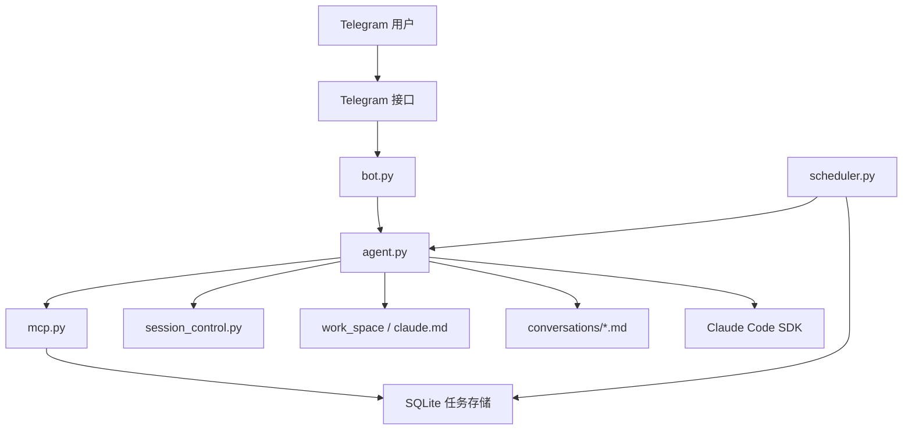

[](README.md)
[](README_CN.md)

# Nano OpenClaw

> 一个具备长期记忆、工作区感知、定时执行与工具调用能力的个人自动化助手运行时，Telegram 只是它当前的入口。

Nano OpenClaw 是一个面向开发者的个人 Agent 项目。  
它并不是简单地把大模型套在 Telegram 外面，而是把 Telegram、Claude Code SDK、MCP 工具、短期会话续接、长期工作区记忆以及轻量级调度器整合成了一个单用户自动化系统。

<p>
  <a href="#为什么是-nano-openclaw"><strong>项目定位</strong></a> ·
  <a href="#核心能力"><strong>核心能力</strong></a> ·
  <a href="#架构概览"><strong>架构</strong></a> ·
  <a href="#快速开始"><strong>快速开始</strong></a> ·
  <a href="#手把手配置流程"><strong>完整配置流程</strong></a> ·
  <a href="#如何使用"><strong>如何使用</strong></a> ·
  <a href="README.md"><strong>English</strong></a>
</p>

## 为什么是 Nano OpenClaw

很多 Telegram AI Bot 本质上只是一个“消息中转层”：

- 收到一条消息
- 发给模型
- 再把结果回给用户

这种方式可以聊天，但很难真正承担“个人自动化助手”的角色。

Nano OpenClaw 的设计思路不一样。它强调的是：

- 助手要有自己的工作区
- 助手要有跨会话记忆
- 助手要能调用工具、读写文件、执行任务
- 助手要能安排未来的工作，而不只是当下回答一句话
- Telegram 只是交互入口，不是系统本体

所以，这个项目更接近一个“个人 Agent 运行时”，而不是一个普通聊天 Bot Demo。

## 核心能力

### 持久记忆

Nano OpenClaw 目前有多层记忆结构：

- 通过 `session_id` 实现短期上下文延续
- 通过 `work_space/claude.md` 维护长期记忆
- 通过 `work_space/conversations/` 保存按日期归档的对话记录

这意味着它既能接上上一次会话，也能逐步沉淀长期信息。

### 以工作区为中心的执行模型

这个项目不是无状态消息回复器。  
Agent 运行时绑定了真实工作区，可以：

- 读取和修改文件
- 编辑文本内容
- 搜索历史归档
- 维护自己的长期记忆文件
- 执行 shell 命令
- 通过 Claude 工具访问网络能力

### Telegram 作为人与系统的接口

Telegram 目前是项目的主要交互入口。  
Bot 可以：

- 接收消息与命令
- 在聊天窗口中直接回复
- 通过 MCP 工具主动给用户发消息
- 通过 `OWNER_ID` 限制只有一个指定用户可使用

### 定时任务能力

项目已经包含轻量级调度能力和 SQLite 任务存储。  
Agent 可以通过 MCP 工具管理定时任务，例如：

- `schedule_task`
- `list_tasks`
- `pause_task`
- `resume_task`
- `cancel_task`

### 模块化结构

当前主线代码已经拆分到 `src/nanoclaw/` 下，主要模块包括：

- 应用启动
- Telegram bot 组装
- Claude Agent 执行
- MCP 工具注册
- 调度器执行
- 数据库存储
- session 持久化
- 工作区初始化
- 日志
- 对话归档

## 架构概览



从用户角度看，它是一个 Telegram 助手；  
从系统角度看，它真正的核心在运行时、记忆层、任务层和 Claude 执行层。

## 项目结构

```text
main.py                         # 启动入口
src/nanoclaw/
  app.py                        # 应用启动与运行时准备
  bot.py                        # Telegram bot 组装与消息处理
  agent.py                      # Claude Agent 执行逻辑
  mcp.py                        # 暴露给 Agent 的 MCP 工具
  scheduler.py                  # APScheduler 定时轮询
  db.py                         # SQLite 任务数据库操作
  config.py                     # 配置、路径、环境变量
  session_control.py            # session_id 持久化
  conversation.py               # 对话归档
  workspace.py                  # 工作区初始化与 system prompt 构建
  logging_utils.py              # 日志模块
work_space/
  claude.md                     # 助手长期记忆
  conversations/                # 按日期保存的历史对话
data/
  state.json                    # 当前会话 session_id
store/
  nanoclaw.db                   # 定时任务数据库
```

## 运行特征

当前项目的运行形态是有意收窄的：

- 单用户
- Telegram long polling
- 本地工作区执行
- 本地 SQLite 持久化
- 对 Agent 开放了较强的工具权限

这很适合个人自动化助手，但不适合直接当成公开多用户服务上线。

## 环境要求

在运行项目之前，你至少需要准备：

- Python `3.12+`
- 本机安装好 [`uv`](https://docs.astral.sh/uv/)
- 一个 Telegram bot token
- 你自己的 Telegram 数字用户 ID
- 一个可供 `claude-agent-sdk` 使用的 Anthropic 兼容 API Key

## 快速开始

如果你已经熟悉 Python 项目，最短路径是：

```bash
git clone https://github.com/buctzzp/nano-openclaw.git
cd nano-openclaw
uv sync
# 手动创建 .env
uv run main.py
```

然后去 Telegram 给你的 bot 发 `/start` 即可。

如果你想严格按步骤配置，请继续看下面的完整流程。

## 手把手配置流程

### 1. 克隆项目

```bash
git clone https://github.com/buctzzp/nano-openclaw.git
cd nano-openclaw
```

### 2. 安装依赖

本项目使用 `uv` 管理依赖。

```bash
uv sync
```

执行后会自动创建 `.venv/`，并根据 `pyproject.toml` / `uv.lock` 安装依赖。

### 3. 创建 `.env`

在项目根目录手动创建一个 `.env` 文件。

建议内容如下：

```env
TELEGRAM_BOT_TOKEN=your_telegram_bot_token
OWNER_ID=your_telegram_numeric_user_id
ANTHROPIC_API_KEY=your_api_key

# 可选：如果你通过兼容网关访问模型，可以填写
ANTHROPIC_BASE_URL=

# 可选：定时任务轮询间隔（秒）
SCHEDULER_INTERVAL=60
```

### 4. 创建 Telegram Bot，并拿到 Bot Token

如果你还没有自己的 Telegram Bot，需要先通过 **@BotFather** 创建。

步骤如下：

1. 打开 Telegram，搜索 `@BotFather`
2. 进入与 BotFather 的对话
3. 发送：

```text
/newbot
```

4. BotFather 会要求你输入：
   - 一个 bot 显示名称
   - 一个 bot 用户名

用户名需要注意：

- 必须以 `bot` 结尾
- 例如：`nano_openclaw_bot`、`my_memory_bot`

5. 创建完成后，BotFather 会返回一段 HTTP API Token，大致长这样：

```text
123456789:AAExampleYourTelegramBotToken
```

把它填进：

```env
TELEGRAM_BOT_TOKEN=...
```

### 5. 找到你自己的 Telegram 数字用户 ID（`OWNER_ID`）

Nano OpenClaw 目前是单 owner 模式，所以你还需要知道自己 Telegram 账号的数字用户 ID。

最稳妥的方式，是直接使用 Telegram 官方 Bot API 的 `getUpdates`。

步骤如下：

1. 先在 Telegram 里给你刚创建的 bot 发一条消息，例如：

```text
/start
```

2. 然后在终端执行：

```bash
curl "https://api.telegram.org/bot<你的BotToken>/getUpdates"
```

把 `<你的BotToken>` 替换成你从 BotFather 拿到的真实 token。

3. 在返回的 JSON 里，找到类似下面的位置：

```json
"from": {
  "id": 123456789,
  ...
}
```

其中这个：

```text
123456789
```

就是你的 Telegram 数字用户 ID。

把它填进：

```env
OWNER_ID=123456789
```

如果 `getUpdates` 没返回你想要的内容，通常优先检查：

- 你是否已经至少给 bot 发过一条消息
- 是否已经有别的 bot 进程在抢占 updates
- 最好在启动 `uv run main.py` 之前先执行这条 `curl`

### 6. 理解每个配置项

- `TELEGRAM_BOT_TOKEN`
  你的 Telegram bot token，从 BotFather 获取。

- `OWNER_ID`
  你自己的 Telegram 数字用户 ID。  
  当前项目是单 owner 模式，只有这个用户可以和 bot 正常交互。

- `ANTHROPIC_API_KEY`
  提供给 `claude-agent-sdk` 使用的模型 API Key。

- `ANTHROPIC_BASE_URL`
  可选项。只有在你使用兼容代理或中转网关时才需要填写。

- `SCHEDULER_INTERVAL`
  可选项。调度器每隔多少秒扫描一次是否有到期任务，默认是 `60` 秒。

### 7. 启动项目

执行：

```bash
uv run main.py
```

如果启动成功，你应该能看到类似这样的日志：

```text
INFO | Preparing runtime environment...
INFO | Database initialized at ...
INFO | Workspace ready at ...
INFO | Starting Telegram bot...
INFO | Scheduler started
INFO | Bot is running...
```

### 8. 确认运行时目录已创建

第一次启动后，项目会自动创建这些目录和文件：

- `work_space/`
- `work_space/claude.md`
- `work_space/conversations/`
- `data/`
- `store/`
- `store/nanoclaw.db`

这些都是运行时数据，默认不会进入 git。

### 9. 在 Telegram 中验证

打开 Telegram，找到你的 bot，发送：

```text
/start
```

如果 `OWNER_ID` 正确，bot 应该会回复欢迎消息。  
如果 bot 没有响应，最常见原因是：

- `OWNER_ID` 填错了
- 你发消息的 Telegram 账号不是配置里的那个 owner

## Telegram 官方参考资料

如果你想看 Telegram 官方文档，对应链接如下：

- BotFather 和创建 Bot： https://core.telegram.org/bots/features
- Bot API 与 `getUpdates`： https://core.telegram.org/bots/api

## 如何使用

### 基础命令

当前 bot 支持这些命令：

- `/start`：开始对话
- `/clear`：清除当前 Claude session
- `/end`：结束当前交互

### 普通对话

你可以直接在 Telegram 里给它发消息，比如：

- 问问题
- 让它读取或修改工作区文件
- 让它记住信息
- 让它帮你安排任务

Agent 会基于当前工作区运行，可能会：

- 读写文件
- 调用 MCP 工具
- 延续之前的会话
- 更新长期记忆

### 记忆系统怎么工作

当前项目的记忆主要分 3 层：

1. `data/state.json`
   保存当前 Claude `session_id`，用于下一轮继续会话。

2. `work_space/claude.md`
   保存长期记忆和项目级指令。

3. `work_space/conversations/YYYY-MM-DD.md`
   保存按日期归档的用户可见聊天记录。

### 定时任务怎么用

调度器会在 bot 启动时自动启动。

当前版本不是通过独立 CLI 来创建任务，而是通过你和 agent 的自然语言交互，让 agent 自己调用定时任务 MCP 工具。

例如你可以尝试：

- `每小时提醒我喝水。`
- `每天上午九点提醒我做今日计划。`
- `在 2026-04-20 08:30:00 提醒我开会。`

当任务到期时，调度器会：

1. 从 SQLite 数据库里找出到期任务
2. 包装任务提示词
3. 调用一个专门的 task agent 去执行
4. 尝试通过 `send_message` 通知用户

## 运行注意事项

### 这是单 owner 项目

当前项目是明确的单用户设计：

- 一个 Telegram owner
- 一个本地运行时
- 一个共享工作区
- 一份当前交互会话状态

这正适合个人自动化助手，但并不适合直接扩成公开多用户系统。

### 工具权限较强

当前 Claude 运行时开放了较强的工具权限。  
这对自动化很有帮助，但也意味着你应该把它当成一个有能力修改本地工作区的 agent 来对待。

建议：

- 只在你信任的工作目录中运行
- 不要暴露给不受信任的用户
- 明确知道它能访问和修改什么

### 运行时数据保存在本地

重要运行时数据都存在本地目录里：

- `data/`：短期 session 状态
- `work_space/`：长期记忆与归档
- `store/nanoclaw.db`：定时任务数据库

如果你删除这些目录，相当于删除了 bot 的本地记忆和任务状态。

## 常见问题排查

### 出现 `telegram.error.Conflict`

这表示同一个 bot token 还有另一个实例正在轮询 Telegram。

常见原因：

- 本机还有旧进程没退出
- 另一台机器也在跑同一个 token
- 后台残留进程没有正常结束

### bot 启动了，但我发消息它不理我

最常见原因是：

- `OWNER_ID` 不对
- 你当前 Telegram 账号不是配置里的 owner

### 定时任务好像没触发

你可以优先检查：

- 任务是否真的写进了数据库
- `SCHEDULER_INTERVAL` 是否过大
- 进程是否持续运行到了任务到期时刻

## 技术栈

- Python 3.12+
- `python-telegram-bot`
- `claude-agent-sdk`
- `apscheduler`
- `aiosqlite`
- `croniter`
- `python-dotenv`
- `uv`

## 项目状态

Nano OpenClaw 现在已经可以作为个人自动化助手使用，但仍在持续演进中。

当前已经具备的优势：

- 持久记忆
- 工作区中心执行
- MCP 工具集成
- 定时任务基础能力
- 模块化代码结构

后续重点演进方向：

- 更丰富的 skill 体系
- 更清晰的可中断执行流
- 更强的记忆组织和检索能力
- Telegram 之外的更多入口

## English Version

英文版本请见 [README.md](README.md)。
