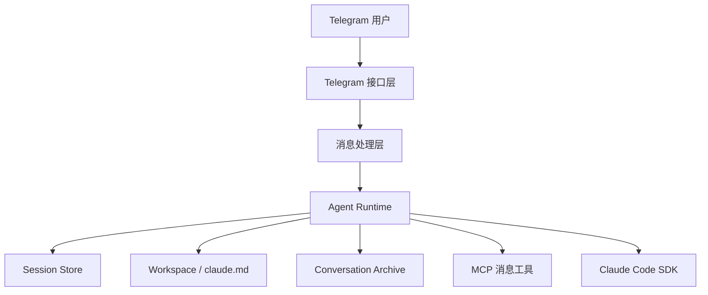

[](README.md)
[](README_CN.md)

# Nano OpenClaw

> 一个具备长期记忆、工作区感知与工具执行能力的个人自动化助手运行时，Telegram 只是它当前的入口。

**Nano OpenClaw 面向的是希望真正“做事”的个人 Agent 系统的开发者。**  
它不是简单的聊天封装，而是一个可以记忆、读写文件、调用工具、在真实工作目录中运行的个人自动化助手底座。

<p>
  <a href="#项目优势"><strong>项目优势</strong></a> ·
  <a href="#架构概览"><strong>架构</strong></a> ·
  <a href="#项目结构"><strong>结构</strong></a> ·
  <a href="#后续演进方向"><strong>路线图</strong></a> ·
  <a href="README.md"><strong>English</strong></a>
</p>

Nano OpenClaw 是一个面向个人自动化场景的 AI 助手项目。  
Telegram 只是它当前的交互入口，真正的核心是一个具备记忆、工作区、工具调用与持续演化能力的 Agent 运行系统。

这不是一个“套了 Telegram 壳子的聊天机器人”，而是一个正在成型的个人自动化助手底座。

## 项目定位

很多 Telegram AI Bot 本质上只是把模型 API 包了一层消息收发：

- 能聊天
- 能问答
- 但不能真正长期工作

Nano OpenClaw 的设计思路不一样。它强调的是：

- 助手应该有自己的工作区
- 助手应该有持续记忆，而不是只记住当前一轮对话
- 助手应该能读写文件、调用工具、处理真实任务
- Telegram 只是入口，未来完全可以替换为别的交互层

因此，这个项目更接近一个“个人 Agent 运行时”，而不是一个普通 Bot Demo。

## 项目优势

### 1. 记忆不是临时的，而是分层的

Nano OpenClaw 同时具备两层记忆：

- 通过 `session_id` 维持会话连续性
- 通过 `work_space/claude.md` 维护长期记忆
- 通过 `work_space/conversations/` 保存按日期归档的历史对话

这意味着助手既能延续当前上下文，也能逐步沉淀长期信息。

### 2. 以工作区为中心，而不是以聊天窗口为中心

这个项目不是无状态的消息回复器。  
Agent 运行时绑定了真实工作区，可以：

- 读取和修改文件
- 维护自己的记忆文件
- 搜索归档对话
- 调用工具处理任务
- 在需要时执行 shell 命令

这让它具备了“做事”的能力，而不只是“说话”的能力。

### 3. 基于 Claude Code SDK，但不是简单套壳

项目使用 `claude-agent-sdk` 作为底层 Agent Runtime，同时在其上构建了自己的工程能力：

- 自定义 system prompt 组装
- 会话持久化
- Telegram 消息桥接
- MCP 方式的助手回发消息
- 工具流式日志记录

因此它不是一层薄封装，而是一个有明确系统边界的上层实现。

### 4. 架构已经模块化，不再是单文件脚本

当前有效实现已经拆分到 `src/nanoclaw/` 下，核心模块分工清晰，包括：

- 应用启动装配
- 配置和路径管理
- 工作区准备
- 对话归档
- session 存储
- MCP 工具接入
- Agent 执行层
- Telegram handlers
- 日志模块

这使得项目后续继续演进时，不会陷入“单文件越来越大、越来越难维护”的状态。

## 架构概览



这个结构里，Telegram 只承担交互入口的角色，真正的持续能力来自运行时、记忆层、工作区和工具系统。

## 项目结构

```text
main.py                    # 当前运行入口
src/nanoclaw/
  app.py                   # 应用装配与启动
  agent.py                 # Claude Agent 执行逻辑与锁
  config.py                # 全局配置、路径、模板
  conversation.py          # 对话归档
  handlers.py              # Telegram 消息与命令处理
  logging_utils.py         # 日志配置
  mcp.py                   # MCP 工具注册
  session_store.py         # session_id 持久化
  workspace.py             # 工作区初始化与 system prompt 构建
work_space/
  claude.md                # 助手长期记忆
  conversations/           # 按日期保存的历史对话
data/
  state.json               # 会话状态
ep1.py ~ ep6.py            # 历史版本保留
```

## 技术栈

- Python 3.12+
- `python-telegram-bot`
- `claude-agent-sdk`
- `python-dotenv`
- 基于 `src/` 布局的工程化包结构

## 当前已经具备的能力

当前版本已经可以：

- 通过 Telegram 接收消息与命令
- 延续 Claude 会话
- 在 `claude.md` 中维护长期记忆
- 将对话按日期归档
- 在真实工作区中调用 Claude 工具
- 通过 Telegram 回发助手消息
- 以模块化结构持续扩展

## 当前边界

这个项目已经具备明确方向，但它还不是一个“大而全”的平台。  
当前版本并不试图立即做到：

- 多用户平台化
- 可随时打断的实时 Agent 调度器
- 生产级任务编排系统
- 通用自动化中台

目前它更聚焦于：**单用户、个人场景、可持续演进的自动化助手**。

## Coming Soon

当前版本已经具备清晰的核心能力，但后续会继续朝更完整的个人自动化助手方向推进，重点包括：

- 更丰富的 skill 体系，用于沉淀可复用的 Agent 能力
- 定时任务与时间驱动的自动化机制
- 更强的长期记忆组织与检索能力
- 更清晰的可中断执行流
- Telegram 之外的更多交互入口

目标不是把项目做成臃肿的平台，而是在保持轻量的前提下，把它打磨成更锋利、更可靠的个人自动化运行时。

## 后续演进方向

这个项目后续非常适合继续向这些方向推进：

- 可中断 Agent 执行
- 更强的长期记忆检索策略
- 更结构化的任务调度
- Telegram 之外的更多交互入口
- 运行时、记忆层、接口层的进一步解耦

## 运行方式

这是一个面向开发者的仓库。  
如果你要在本地启动当前版本，最直接的方式是：

```bash
uv run main.py
```

前提是你已经准备好 `.env` 中所需的 Telegram 与模型相关配置。

## 项目状态

Nano OpenClaw 目前处于持续迭代阶段。  
`ep1.py` 到 `ep6.py` 保留了项目历史演进轨迹，而 `src/nanoclaw/` 下的模块化实现是当前主线版本。

## English Version

英文版本请见 [README.md](README.md)。
